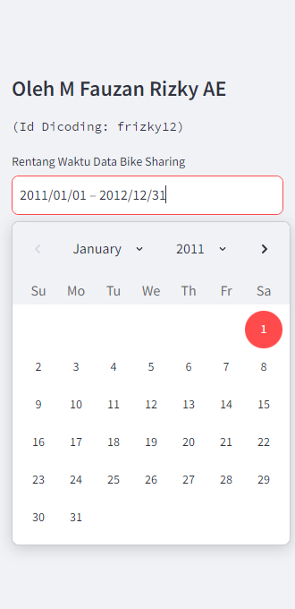
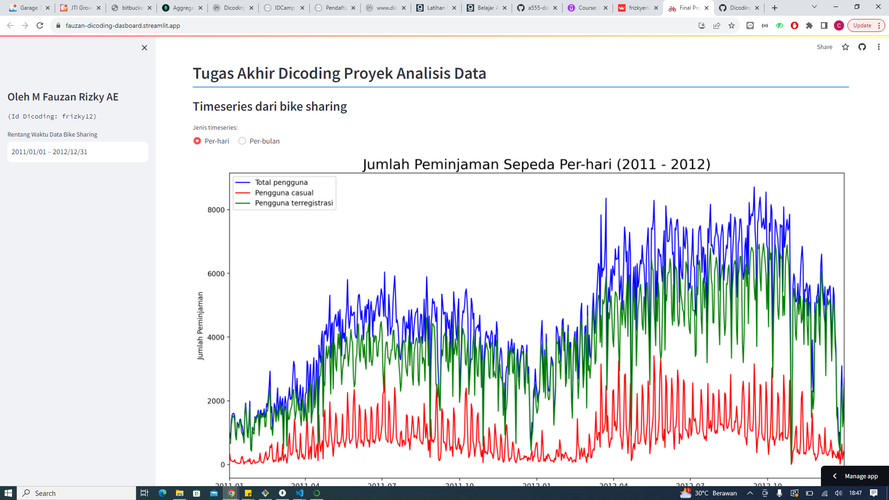
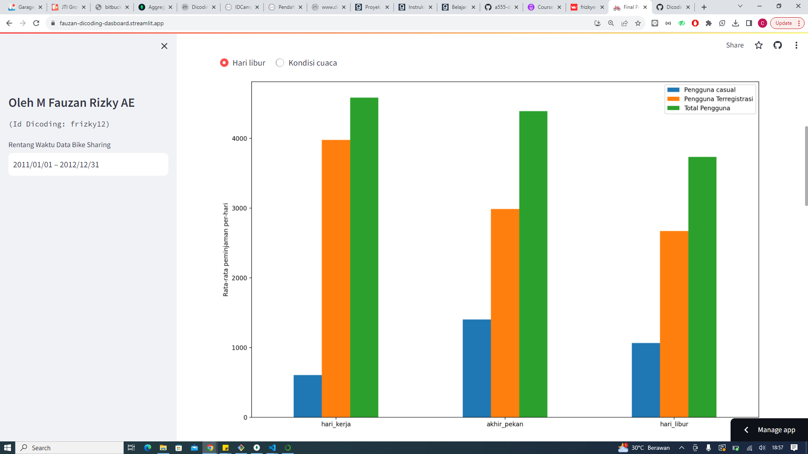
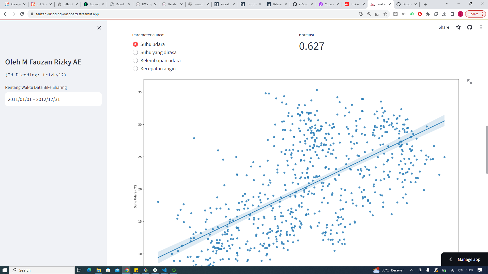
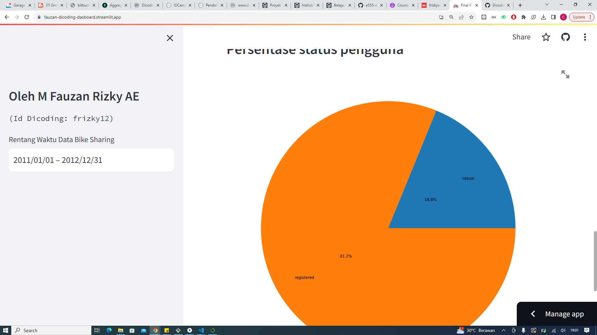

# Dicoding Collection Dashboard ✨

## Setup Environment

```
conda create --name main-ds python=3.9
conda activate main-ds
pip install numpy pandas scipy matplotlib seaborn jupyter streamlit
```

## Run Streamlit App

Pastikan sudah berada di directory folder dashboard

```
streamlit run dashboard.py
```

## Deployment Streamlit App

url dashboard: https://fauzan-dicoding-dasboard.streamlit.app/



Pada bagian sidebar, dapat ditentukan rentang data yang akan dipakai



Pada plot timeseries ada opsi harian dan bulanan



Pada barplot ada opsi untuk data berdasarkan cuaca pada hari itu atau status hari liburnya



Pada scatter plot ada opsi untuk tiap parameter cuacanya (temp, atemp, hum, dan windspeed)



Pada diagram Pie ditampilkan perbandingan pengguna teregistrasi dan casual
